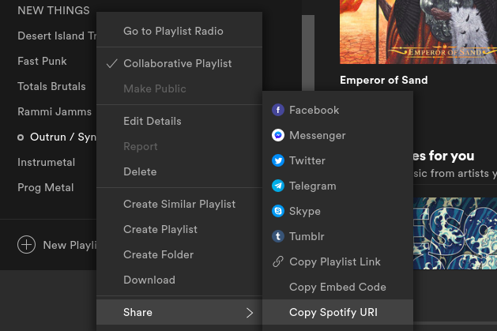

# spotify\_collage
`spotify\_collage` provides a simple method of retrieving all unique album art from either a Spotify playlist or artist on Spotify and creating a collage from the query.

## Installation:
```bash
git clone https://github.com/orioncrocker/spotify_images
```

## Setup:
Before using this program, you'll need to get credentials from [Spotify's API](https://developer.spotify.com/documentation/web-api/quick-start/). An account on Spotify will provide two credentials: 'client id' and 'client secret.' In order to use your own credentials, you will have to create a file named `config.py.` A file name `your_config.py` has been provided for you to modify.

Your `config.py` file should have these two fields:
```python
client_id = 'your client id'
client_secret = 'your client secret'
```

# Usage:

## Get all album art from an artist:

Download all album artwork from a specific artist on Spotify
```bash
python3 main.py -a 'Carpenter Brut'
```
```
7 saved to results/carpenter_brut
```

This option did not take advantage of the `verbose` flag `-v` or `collage` flag `-c`. When using both of these flags, the output will look as such.

```bash
python3 main.py -vca 'Carpenter Brut'
```
```
results/carpenter_brut/trilogy.jpeg
results/carpenter_brut/leather_teeth.jpeg
results/carpenter_brut/carpenterbrutlive.jpeg
results/carpenter_brut/night_stalker_(from_"the_rise_of_the_synths").jpeg
results/carpenter_brut/hush_sally,_hush!.jpeg
results/carpenter_brut/maniac_(live).jpeg
results/carpenter_brut/turbo_killer_(live).jpeg
Total unique pictures: 7
Rows: 2	Cols: 3
Collage saved as: results/carpenter_brut.jpeg
```
The resulting collage:

[](https://github.com/orioncrocker/spotify_images/blob/master/examples/collage.jpeg)

## Get all album art from a playlist:

To save all images of a playlist, you will need to URI of the playlist from Spotify. This can be found on Spotify's application or web browser

[](https://github.com/orioncrocker/spotify_images/blob/master/examples/uri.png)

```bash
python3 main.py -vcp spotify:playlist:1l3ttggvijrdbYX8lsZ7eI
```
```
results/outrun_ynthwave/near_dark.jpeg
results/outrun_synthwave/into_the_abyss.jpeg
results/outrun_synthwave/send_the_signal.jpeg
results/outrun_synthwave/the_shape.jpeg
results/outrun_synthwave/volume_1.jpeg
results/outrun_synthwave/trilogy.jpeg
results/outrun_synthwave/this_means_war.jpeg
results/outrun_synthwave/dangerous_days.jpeg
results/outrun_synthwave/the_wrath_of_code.jpeg
results/outrun_synthwave/bad_mood_(deluxe).jpeg
results/outrun_synthwave/gunship.jpeg
results/outrun_synthwave/the_real_deal.jpeg
results/outrun_synthwave/storm_city.jpeg
results/outrun_synthwave/leather_teeth.jpeg
Total unique pictures: 14
Rows: 3	Cols: 4
Collage saved as: results/outrun_synthwave.jpeg
```
The resulting collage:

[](https://github.com/orioncrocker/spotify_images/blob/master/examples/outrun.jpeg)

To specify the output location and name of a collage file, use the `-o` flag.
```bash
python3 main.py -cp spotify:playlist:1l3ttggvijrdbYX8lsZ7eI -o output
```
```
Collage saved as: output.jpeg
```

There is no need to add a file extension to the name, as the default always saves as a `.jpeg`.

## Planned features:
Specific width and height, for the purposes of creating wallpapers for screens of various resolutions. This requires more math than my small brain can comprehend in a small amount of time.
