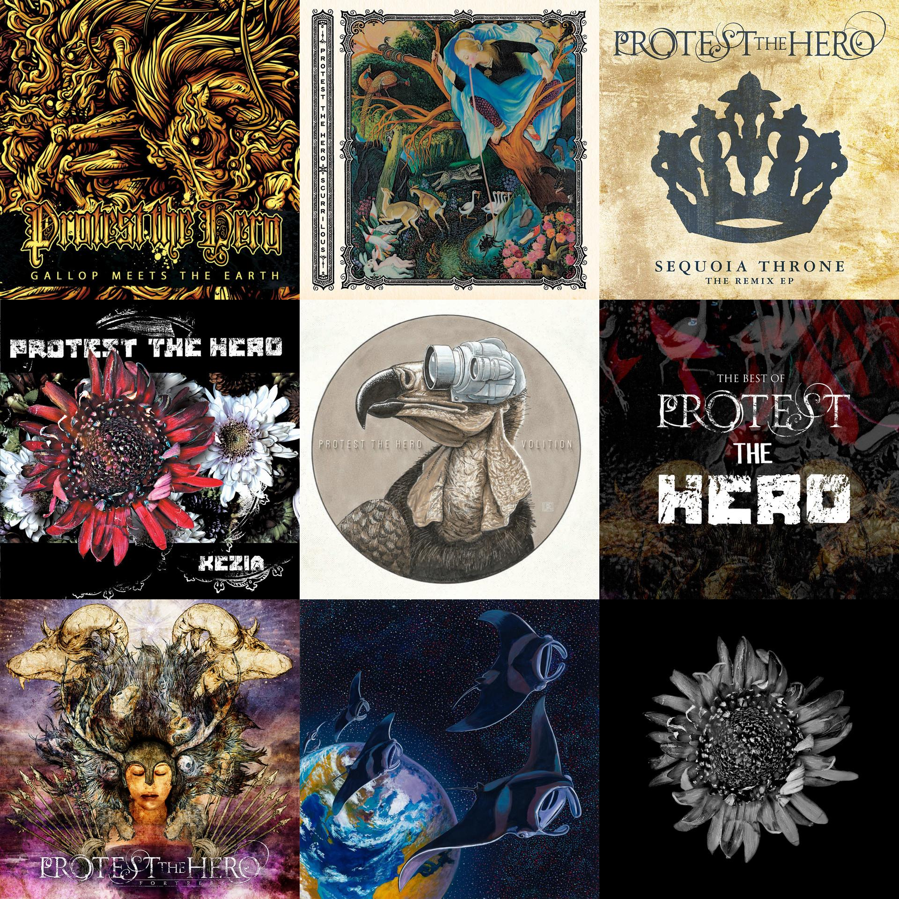

# spotify\_images
`spotify_images` provides a simple method of retrieving all unique album art from either a Spotify playlist or artist on Spotify and creating a collage from the query.

## Installation:
```bash
git clone https://github.com/orioncrocker/spotify_images
```

## Setup:
Before using this program, you'll need to get credentials from [Spotify's API](https://developer.spotify.com/documentation/web-api/quick-start/).
An account on Spotify will provide two credentials: 'client id' and 'client secret.'

Modify the `config.py` file's two fields:
```python
client_id = 'your_client_id'
client_secret = 'your_client_secret'
```

Two prerequisites you'll need installed on your machine are pillow and spotipy.
You can easily get both of these from the `pip` repository.
If you aren't yet aware of the beauty of `pip`, go check out [it's website](https://pypi.org/project/pip/).
You're welcome.

```bash
pip3 install -r requirements.txt
```

# Usage:

## Download album art from an artist or playlist:
By default `spotify_images` fetches all unique art of any Spotify arist or playlist link given as an argument
```bash
python3 main.py https://open.spotify.com/playlist/13OSe3KLY2qnUrdP2Sv6j7
```

## Verbose
Use the `-v` or `--verbose` flag to see what the program is doing in real time.

## Create a collage
Use the `-c` or `--collage` collage flag to create a collage of the artwork downloaded.

```bash
python3 main.py -vc https://open.spotify.com/playlist/13OSe3KLY2qnUrdP2Sv6j7
Name: SRC#15
Type: playlist
results/src#15/blade_runner_(music_from_the_original_soundtrack).jpeg
results/src#15/low_country.jpeg
results/src#15/true_widow.jpeg
results/src#15/these_changing_skies.jpeg
results/src#15/odyssey.jpeg
results/src#15/can't_buy_happiness.jpeg
results/src#15/reptilians.jpeg
results/src#15/dangerous_days.jpeg
results/src#15/volume_1_(deluxe_edition).jpeg
results/src#15/led_zeppelin_iv.jpeg
results/src#15/lunz.jpeg
results/src#15/tempel.jpeg
12 saved to results/src#15
Total unique pictures: 12
Rows: 3	Cols: 4
Collage saved as: results/src#15.jpeg
```
The resulting collage:



## Future features:
I would love to be able to specify a width and height for the purposes of creating wallpapers.
Additionally, a website that hosts this code via [Flask](https://flask.palletsprojects.com/en/1.1.x/) 
would be ideal so that anyone could utilize this software without the hassle of installation and configuration.
However if I'm going do that I may as well rewrite this program in Javascript and save myself some trouble.
